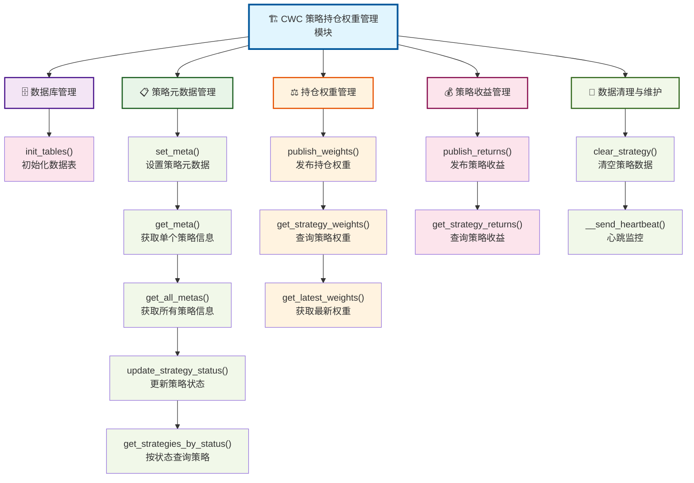

# CWC 策略持仓权重管理模块使用指南

## 1. 概述

CWC（ClickHouse Weights Client）是基于 ClickHouse 数据库的策略持仓权重管理模块，提供了完整的策略元数据管理、持仓权重发布、日收益记录等功能。

### 1.1 主要功能

- **策略元数据管理**：管理策略基本信息，包括策略名称、描述、作者、样本外时间等
- **持仓权重管理**：发布和查询策略的持仓权重数据
- **日收益管理**：记录和查询策略的日收益数据
- **心跳监控**：实时监控策略运行状态
- **数据清理**：支持策略数据的清空操作

### 1.2 功能架构图



### 1.3 函数功能速查表

| 功能分类 | 函数名 | 主要功能 | 常用参数 |
|:---------|:-------|:---------|:---------|
| **🗄️ 数据库管理** | `init_tables()` | 初始化所有数据表 | `database`, `db` |
| **📋 策略元数据** | `set_meta()` | 设置策略基本信息 | `strategy`, `description`, `author`, `status` |
| | `get_meta()` | 获取单个策略信息 | `strategy` |
| | `get_all_metas()` | 获取所有策略信息 | 无 |
| | `update_strategy_status()` | 更新策略状态 | `strategy`, `status` |
| | `get_strategies_by_status()` | 按状态筛选策略 | `status` |
| **⚖️ 持仓权重** | `publish_weights()` | 发布策略权重数据 | `strategy`, `df`, `batch_size` |
| | `get_strategy_weights()` | 查询策略权重 | `strategy`, `sdt`, `edt`, `symbols` |
| | `get_latest_weights()` | 获取最新权重 | `strategy` |
| **💰 策略收益** | `publish_returns()` | 发布策略收益数据 | `strategy`, `df`, `batch_size` |
| | `get_strategy_returns()` | 查询策略收益 | `strategy`, `sdt`, `edt`, `symbols` |
| **🧹 数据清理** | `clear_strategy()` | 清空策略数据 | `strategy`, `human_confirm` |

### 1.4 环境配置

使用前需要在环境变量中设置 ClickHouse 连接信息：

```bash
CLICKHOUSE_HOST=127.0.0.1        # 服务器地址
CLICKHOUSE_PORT=9000             # 服务器端口
CLICKHOUSE_USER=default          # 用户名
CLICKHOUSE_PASS=                 # 密码（可为空）
```

## 2. 数据库设计

### 2.1 数据库表结构

CWC 模块使用 `czsc_strategy` 数据库，包含以下数据表：

#### 2.1.1 策略元数据表（metas）

```sql
CREATE TABLE czsc_strategy.metas (
    strategy String NOT NULL,          -- 策略名（唯一且不能为空）
    base_freq String,                  -- 周期
    description String,                -- 描述
    author String,                     -- 作者
    outsample_sdt DateTime,            -- 样本外起始时间
    create_time DateTime,              -- 策略入库时间
    update_time DateTime,              -- 策略更新时间
    heartbeat_time DateTime,           -- 最后一次心跳时间
    weight_type String,                -- 策略上传的权重类型，ts 或 cs
    status String DEFAULT '实盘',       -- 策略状态：实盘、废弃
    memo String                        -- 策略备忘信息
) 
ENGINE = ReplacingMergeTree()
ORDER BY strategy;
```

#### 2.1.2 持仓权重表（weights）

```sql
CREATE TABLE czsc_strategy.weights (
    dt DateTime,                       -- 持仓权重时间
    symbol String,                     -- 符号（股票代码等标识符）
    weight Float64,                    -- 策略持仓权重值
    strategy String,                   -- 策略名称
    update_time DateTime               -- 持仓权重更新时间
) 
ENGINE = ReplacingMergeTree()
ORDER BY (strategy, dt, symbol);
```

#### 2.1.3 最新权重视图（latest_weights）

```sql
CREATE VIEW czsc_strategy.latest_weights AS
SELECT
   strategy,
   symbol,
   argMax(dt, dt) as latest_dt,
   argMax(weight, dt) as latest_weight,
   argMax(update_time, dt) as latest_update_time
FROM czsc_strategy.weights
GROUP BY strategy, symbol;
```

#### 2.1.4 策略收益表（returns）

```sql
CREATE TABLE czsc_strategy.returns (
    dt DateTime,                       -- 时间
    symbol String,                     -- 符号（股票代码等标识符）
    returns Float64,                   -- 策略收益，从上一个 dt 到当前 dt 的收益
    strategy String,                   -- 策略名称
    update_time DateTime               -- 更新时间
)
ENGINE = ReplacingMergeTree()
ORDER BY (strategy, dt, symbol);
```

### 2.2 数据表初始化

```python
import czsc.cwc as cwc

# 初始化数据表
cwc.init_tables()
```

## 3. 核心功能使用

### 3.1 策略元数据管理

#### 设置策略元数据

```python
import czsc.cwc as cwc

# 设置策略元数据
cwc.set_meta(
    strategy="my_strategy",           # 策略名称
    base_freq="D",                    # 基础频率
    description="我的测试策略",        # 策略描述
    author="张三",                    # 作者
    outsample_sdt="2021-01-01",      # 样本外起始时间
    weight_type="ts",                # 权重类型：ts（时间序列）或 cs（截面）
    status="实盘",                   # 策略状态：实盘 或 废弃
    memo="测试用途",                  # 备注信息
    overwrite=False                  # 是否覆盖已有数据
)
```

#### 获取策略元数据

```python
# 获取单个策略元数据
meta = cwc.get_meta("my_strategy")
print(meta)

# 获取所有策略元数据
all_metas = cwc.get_all_metas()
print(all_metas)

# 根据状态获取策略列表
active_strategies = cwc.get_strategies_by_status(status="实盘")
deprecated_strategies = cwc.get_strategies_by_status(status="废弃")
all_strategies = cwc.get_strategies_by_status()  # 获取所有状态的策略

# 更新策略状态
cwc.update_strategy_status(strategy="my_strategy", status="废弃")
```

### 3.2 持仓权重管理

#### 发布持仓权重

```python
import pandas as pd

# 准备权重数据
# DataFrame 需要包含 dt, symbol, weight 三列
weight_data = pd.DataFrame({
    'dt': ['2023-01-01', '2023-01-01', '2023-01-02', '2023-01-02'],
    'symbol': ['000001.SZ', '000002.SZ', '000001.SZ', '000002.SZ'],
    'weight': [0.5, 0.5, 0.6, 0.4]
})

# 发布权重数据
cwc.publish_weights(
    strategy="my_strategy",
    df=weight_data,
    batch_size=100000               # 批量大小
)
```

#### 查询持仓权重

```python
# 获取策略所有权重数据
weights = cwc.get_strategy_weights(strategy="my_strategy")

# 按时间范围查询
weights = cwc.get_strategy_weights(
    strategy="my_strategy",
    sdt="2023-01-01",              # 开始时间
    edt="2023-12-31"               # 结束时间
)

# 按品种查询
weights = cwc.get_strategy_weights(
    strategy="my_strategy",
    symbols=["000001.SZ", "000002.SZ"]  # 指定品种
)

# 获取最新权重
latest_weights = cwc.get_latest_weights(strategy="my_strategy")
```

### 3.3 策略收益管理

#### 发布策略日收益

```python
# 准备收益数据
# DataFrame 需要包含 dt, symbol, returns 三列
returns_data = pd.DataFrame({
    'dt': ['2023-01-01', '2023-01-01', '2023-01-02', '2023-01-02'],
    'symbol': ['000001.SZ', '000002.SZ', '000001.SZ', '000002.SZ'],
    'returns': [0.01, 0.02, -0.01, 0.03]
})

# 发布收益数据
cwc.publish_returns(
    strategy="my_strategy",
    df=returns_data,
    batch_size=100000
)
```

#### 查询策略收益

```python
# 获取策略收益数据
returns = cwc.get_strategy_returns(strategy="my_strategy")

# 按时间范围查询
returns = cwc.get_strategy_returns(
    strategy="my_strategy",
    sdt="2023-01-01",
    edt="2023-12-31"
)

# 按品种查询
returns = cwc.get_strategy_returns(
    strategy="my_strategy",
    symbols=["000001.SZ", "000002.SZ"]
)
```

### 3.4 策略状态管理

```python
# 更新策略状态
cwc.update_strategy_status(
    strategy="my_strategy",
    status="废弃"                    # 将策略状态设置为废弃
)

# 根据状态获取策略列表
active_strategies = cwc.get_strategies_by_status(status="实盘")
deprecated_strategies = cwc.get_strategies_by_status(status="废弃")

# 获取所有策略（不限状态）
all_strategies = cwc.get_strategies_by_status()
```

### 3.5 策略清理

```python
# 清空策略所有数据（需要人工确认）
# 删除前会显示策略的详细数据概况，包括：
# - 策略状态、创建时间、最后更新时间
# - 权重数据量和时间范围
# - 收益数据量和时间范围
# - 总计删除记录数
cwc.clear_strategy(
    strategy="my_strategy",
    human_confirm=True              # 是否需要人工确认
)

# 示例输出：
# 策略 my_strategy 数据概况:
#   - 策略状态: 废弃
#   - 创建时间: 2023-01-01 10:00:00
#   - 最后更新: 2023-12-01 15:30:00
#   - 权重数据: 125,430 条
#     时间范围: 2023-01-01 至 2023-11-30
#   - 收益数据: 45,200 条
#     时间范围: 2023-01-01 至 2023-11-30
#   - 总计将删除: 170,631 条记录
# 
# ============================================================
# ⚠️  警告：即将删除策略 my_strategy 的所有数据
# ============================================================
# 请仔细确认上述信息，确认删除请输入 'DELETE' (大小写敏感):
```

## 4. 使用案例

### 4.1 完整的策略管理流程

```python
import pandas as pd
import czsc.cwc as cwc

# 1. 初始化数据表
cwc.init_tables()

# 2. 设置策略元数据
cwc.set_meta(
    strategy="quantitative_strategy_v1",
    base_freq="D", 
    description="基于技术指标的量化选股策略",
    author="量化团队",
    outsample_sdt="2023-01-01",
    weight_type="ts",
    status="实盘",
    memo="第一版策略实现"
)

# 3. 准备并发布权重数据
weight_data = pd.read_csv("strategy_weights.csv")  # 加载权重数据
cwc.publish_weights(
    strategy="quantitative_strategy_v1",
    df=weight_data
)

# 4. 准备并发布收益数据  
returns_data = pd.read_csv("strategy_returns.csv")  # 加载收益数据
cwc.publish_returns(
    strategy="quantitative_strategy_v1", 
    df=returns_data
)

# 5. 查询和分析
latest_weights = cwc.get_latest_weights(strategy="quantitative_strategy_v1")
recent_returns = cwc.get_strategy_returns(
    strategy="quantitative_strategy_v1",
    sdt="2023-12-01"
)
```

### 4.2 批量权重更新

```python
# 模拟实时权重更新场景
import time

def update_strategy_weights(strategy_name, new_weights_df):
    """更新策略权重的函数"""
    try:
        # 发布新权重（只会插入比现有数据更新的权重）
        cwc.publish_weights(
            strategy=strategy_name,
            df=new_weights_df,
            batch_size=50000
        )
        print(f"策略 {strategy_name} 权重更新成功")
        
    except Exception as e:
        print(f"权重更新失败: {e}")

# 使用示例
for day in pd.date_range("2023-01-01", "2023-01-10"):
    daily_weights = generate_daily_weights(day)  # 假设的权重生成函数
    update_strategy_weights("my_strategy", daily_weights)
    time.sleep(1)  # 模拟间隔
```

### 4.3 多策略管理

```python
strategies = ["strategy_a", "strategy_b", "strategy_c"]

# 批量设置策略元数据
for i, strategy in enumerate(strategies):
    cwc.set_meta(
        strategy=strategy,
        base_freq="D",
        description=f"策略{chr(65+i)}的描述",
        author="策略团队",
        outsample_sdt="2023-01-01",
        weight_type="ts",
        status="实盘"
    )

# 获取所有策略的最新权重
all_latest_weights = cwc.get_latest_weights()
strategy_summary = all_latest_weights.groupby('strategy').agg({
    'weight': ['sum', 'count'],
    'dt': 'max'
}).round(4)

print("策略权重汇总:")
print(strategy_summary)
```

### 4.4 策略生命周期管理

```python
# 策略生命周期管理示例
def manage_strategy_lifecycle(strategy_name):
    """管理策略完整生命周期"""
    
    # 1. 创建新策略
    cwc.set_meta(
        strategy=strategy_name,
        base_freq="D",
        description="新创建的量化策略",
        author="算法团队",
        outsample_sdt="2024-01-01",
        status="实盘"  # 默认为实盘状态
    )
    
    # 2. 发布权重数据
    weight_data = generate_strategy_weights()  # 假设的权重生成函数
    cwc.publish_weights(strategy=strategy_name, df=weight_data)
    
    # 3. 监控策略表现
    performance = evaluate_strategy_performance(strategy_name)  # 假设的评估函数
    
    # 4. 根据表现决定是否废弃策略
    if performance['sharpe_ratio'] < 0.5:
        print(f"策略 {strategy_name} 表现不佳，标记为废弃")
        cwc.update_strategy_status(strategy=strategy_name, status="废弃")
    
    return performance

# 批量管理多个策略状态
def batch_update_strategy_status():
    """批量更新策略状态"""
    
    # 获取所有实盘策略
    active_strategies = cwc.get_strategies_by_status(status="实盘")
    
    for _, strategy_info in active_strategies.iterrows():
        strategy_name = strategy_info['strategy']
        
        # 检查最后心跳时间
        last_heartbeat = pd.to_datetime(strategy_info['heartbeat_time'])
        days_since_heartbeat = (pd.Timestamp.now() - last_heartbeat).days
        
        # 如果超过30天没有心跳，标记为废弃
        if days_since_heartbeat > 30:
            print(f"策略 {strategy_name} 超过30天无心跳，标记为废弃")
            cwc.update_strategy_status(strategy=strategy_name, status="废弃")

# 获取策略状态统计
def get_strategy_status_summary():
    """获取策略状态统计信息"""
    all_strategies = cwc.get_all_metas()
    
    status_summary = all_strategies['status'].value_counts()
    print("策略状态统计:")
    print(status_summary)
    
    return status_summary
```

## 5. 最佳实践

### 5.1 数据发布最佳实践

1. **批量发布**：使用合适的 `batch_size`（建议 50,000-100,000）避免内存溢出
2. **增量更新**：系统会自动过滤已存在的数据，只插入新数据
3. **数据校验**：发布前确保数据格式正确，包含必要的列
4. **错误处理**：在生产环境中添加异常处理和重试机制

```python
def safe_publish_weights(strategy, df, max_retries=3):
    """安全的权重发布函数"""
    for attempt in range(max_retries):
        try:
            cwc.publish_weights(strategy=strategy, df=df)
            return True
        except Exception as e:
            print(f"发布失败 (尝试 {attempt + 1}/{max_retries}): {e}")
            if attempt == max_retries - 1:
                raise
            time.sleep(2 ** attempt)  # 指数退避
    return False
```

### 5.2 数据查询最佳实践

1. **时间范围限制**：查询大量历史数据时指定时间范围
2. **品种过滤**：在需要时使用 `symbols` 参数过滤特定品种
3. **结果缓存**：对于频繁查询的数据考虑缓存机制

```python
def get_strategy_performance(strategy, days=30):
    """获取策略近期表现"""
    end_date = pd.Timestamp.now()
    start_date = end_date - pd.Timedelta(days=days)
    
    # 获取权重和收益数据
    weights = cwc.get_strategy_weights(
        strategy=strategy,
        sdt=start_date.strftime('%Y-%m-%d'),
        edt=end_date.strftime('%Y-%m-%d')
    )
    
    returns = cwc.get_strategy_returns(
        strategy=strategy, 
        sdt=start_date.strftime('%Y-%m-%d'),
        edt=end_date.strftime('%Y-%m-%d')
    )
    
    return weights, returns
```

### 5.3 监控和维护最佳实践

1. **心跳监控**：系统会自动发送心跳，监控策略运行状态
2. **定期清理**：清理不再使用的测试策略数据
3. **备份策略**：定期备份重要策略的权重数据

```python
def monitor_strategy_health():
    """监控策略健康状态"""
    # 只监控实盘状态的策略
    active_strategies = cwc.get_strategies_by_status(status="实盘")
    
    current_time = pd.Timestamp.now()
    for _, meta in active_strategies.iterrows():
        heartbeat_time = pd.to_datetime(meta['heartbeat_time'])
        time_diff = current_time - heartbeat_time
        
        if time_diff > pd.Timedelta(hours=24):
            print(f"警告: 实盘策略 {meta['strategy']} 超过24小时无心跳")
            
            # 可以考虑自动标记为废弃
            if time_diff > pd.Timedelta(days=7):
                print(f"策略 {meta['strategy']} 超过7天无心跳，自动标记为废弃")
                cwc.update_strategy_status(strategy=meta['strategy'], status="废弃")
```

### 5.4 数据质量保证

1. **权重归一化**：确保权重数据符合预期范围
2. **数据一致性**：权重和收益数据的时间对齐
3. **异常值检测**：识别和处理异常的权重或收益值

```python
def validate_weights(df):
    """验证权重数据质量"""
    # 检查必要列
    required_cols = ['dt', 'symbol', 'weight']
    missing_cols = set(required_cols) - set(df.columns)
    if missing_cols:
        raise ValueError(f"缺少必要列: {missing_cols}")
    
    # 检查权重范围
    if df['weight'].abs().max() > 1:
        print("警告: 发现绝对值大于1的权重")
    
    # 检查时间格式
    df['dt'] = pd.to_datetime(df['dt'])
    
    return df
```

### 5.5 策略状态管理最佳实践

1. **状态转换规则**：建立清晰的策略状态转换规则
2. **定期清理**：定期清理废弃策略的历史数据，删除前查看数据概况
3. **状态监控**：监控实盘策略的运行状态，及时发现异常
4. **审批流程**：重要策略的状态变更应该有审批流程

```python
# 策略状态管理的最佳实践示例
def strategy_status_management():
    """策略状态管理最佳实践"""
    
    # 1. 定期检查策略状态
    def daily_strategy_check():
        active_strategies = cwc.get_strategies_by_status(status="实盘")
        for _, strategy in active_strategies.iterrows():
            # 检查策略表现、心跳等指标
            check_strategy_health(strategy['strategy'])
    
    # 2. 安全的状态更新函数
    def safe_update_status(strategy, new_status, reason=""):
        try:
            # 记录状态变更日志
            logger.info(f"准备将策略 {strategy} 状态更新为 {new_status}，原因: {reason}")
            
            # 更新状态
            cwc.update_strategy_status(strategy=strategy, status=new_status)
            
            # 发送通知（如果需要）
            send_notification(f"策略 {strategy} 状态已更新为 {new_status}")
            
        except Exception as e:
            logger.error(f"更新策略 {strategy} 状态失败: {e}")
    
    # 3. 废弃策略数据清理
    def cleanup_deprecated_strategies(days_threshold=90):
        """清理长期废弃的策略数据"""
        deprecated_strategies = cwc.get_strategies_by_status(status="废弃")
        
        for _, strategy in deprecated_strategies.iterrows():
            update_time = pd.to_datetime(strategy['update_time'])
            days_deprecated = (pd.Timestamp.now() - update_time).days
            
            if days_deprecated > days_threshold:
                strategy_name = strategy['strategy']
                print(f"策略 {strategy_name} 已废弃 {days_deprecated} 天，考虑清理数据")
                
                # 安全清理：先查看数据概况，再决定是否删除
                # clear_strategy 会自动显示数据概况和安全确认
                # cwc.clear_strategy(strategy=strategy_name, human_confirm=True)
    
    # 4. 安全的批量清理函数
    def safe_batch_cleanup(strategies_to_clean, dry_run=True):
        """安全的批量清理函数"""
        for strategy in strategies_to_clean:
            if dry_run:
                # 仅查看数据概况，不实际删除
                print(f"[DRY RUN] 策略 {strategy} 数据概况:")
                meta = cwc.get_meta(strategy)
                if meta:
                    print(f"  状态: {meta.get('status')}")
                    print(f"  创建时间: {meta.get('create_time')}")
                    # 这里可以添加更多概况信息
            else:
                # 实际删除（需要人工确认）
                cwc.clear_strategy(strategy=strategy, human_confirm=True)
```

## 6. 注意事项

1. **环境变量配置**：确保 ClickHouse 连接参数正确配置
2. **数据库权限**：确保数据库用户有足够的读写权限
3. **策略命名**：使用有意义的策略名称，避免重复
4. **策略状态**：合理使用策略状态，避免误标记实盘策略为废弃
5. **数据备份**：重要数据定期备份，避免意外丢失
6. **版本管理**：策略更新时考虑版本管理机制
7. **状态审计**：定期审计策略状态变更，确保合规性

通过以上文档，你可以全面了解和使用 CWC 模块进行策略持仓权重管理。 