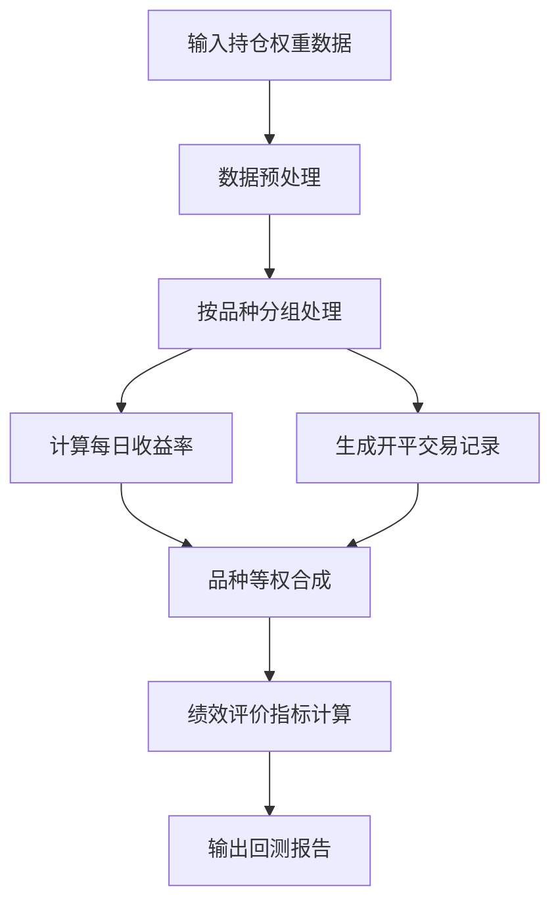
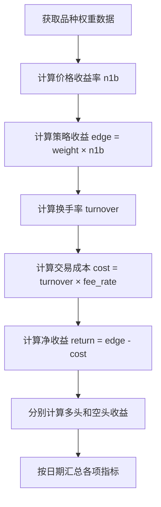
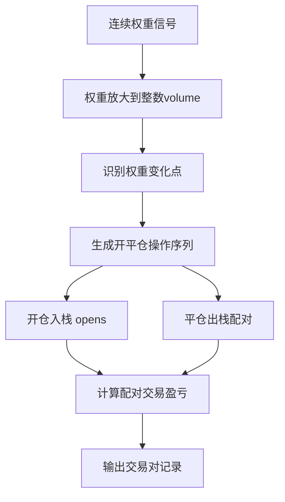
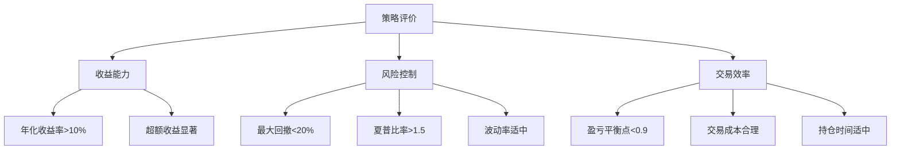
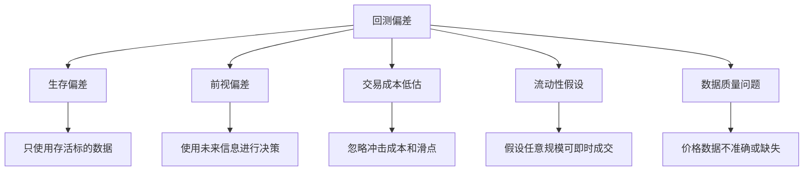

# 策略回测原理

参考 czsc\traders\weight_backtest.py 中的 WeightBacktest 代码，向刚接触量化的朋友解释一下按持仓权重回测的基本原理。

## 1. 什么是按持仓权重回测

按持仓权重回测是一种基于时间序列的投资组合回测方法，其核心思想是：

- **权重驱动**：策略输出的不是买卖信号，而是在每个时间点对各个标的的持仓权重
- **连续调整**：权重可以是连续值（如0.3、-0.5等），而不仅仅是离散的买入/卖出信号  
- **资金配置**：通过权重来决定资金的配置比例，正权重表示多头，负权重表示空头
- **动态平衡**：每个时间点根据新的权重信号调整持仓，实现动态平衡

### 数据输入格式

回测的输入数据格式如下：

```
dt                   symbol    weight    price
===================  ========  ========  =======
2019-01-02 09:01:00  DLi9001   0.5       961.695
2019-01-02 09:02:00  DLi9001   0.25      960.72
2019-01-02 09:03:00  DLi9001   0.25      962.669
2019-01-02 09:04:00  DLi9001   0.25      960.72
2019-01-02 09:05:00  DLi9001   0.25      961.695
```

其中：
- **dt**: K线结束时间，必须是连续的交易时间序列
- **symbol**: 合约代码或股票代码
- **weight**: 持仓权重，范围通常在[-1, 1]之间，0表示空仓
- **price**: 对应的交易价格（收盘价、开盘价或成交均价等）

## 2. 权重回测的工作流程



### 2.1 核心计算流程

1. **收益计算**：根据权重变化和价格变化计算每个时间点的收益
2. **成本计算**：根据权重变化计算交易成本
3. **净收益计算**：收益减去交易成本得到净收益
4. **组合合成**：将多个品种的收益按策略类型合成总收益

## 3. 核心函数详解

### 3.1 get_symbol_daily() - 品种日收益计算

`get_symbol_daily()` 函数是回测的核心，负责计算单个品种每日的交易收益和成本。

#### 3.1.1 计算原理

该函数的计算步骤如下：



#### 3.1.2 关键计算公式

1. **价格收益率 (n1b)**：
   ```python
   n1b = price_t+1 / price_t - 1
   ```
   表示从当前价格到下一个时间点价格的变化率

2. **策略收益 (edge)**：
   ```python  
   edge = weight_t × n1b_t
   ```
   策略在该时间点的理论收益，权重为正时做多，为负时做空

3. **换手率 (turnover)**：
   ```python
   turnover = |weight_t - weight_t-1|
   ```
   权重变化的绝对值，表示交易活跃程度

4. **交易成本 (cost)**：
   ```python
   cost = turnover × fee_rate
   ```
   基于换手率计算的交易费用

5. **净收益 (return)**：
   ```python
   return = edge - cost  
   ```
   扣除交易成本后的实际收益

#### 3.1.3 多空分离计算

为了更精细地分析策略表现，函数还会分别计算多头和空头的收益：

```python
# 多头权重：只保留正权重
long_weight = max(0, weight)

# 空头权重：只保留负权重  
short_weight = min(0, weight)

# 分别计算多空收益和成本
long_edge = long_weight × n1b
short_edge = short_weight × n1b

long_return = long_edge - long_cost
short_return = short_edge - short_cost
```

#### 3.1.4 输出结果示例

```
date        symbol    edge        return      cost       n1b        turnover
==========  ========  ==========  ==========  ========   =======    ========
2019-01-02  DLi9001   0.002303    0.001959    0.00085    0.004606   0.5
2019-01-03  DLi9001   0.004256    0.003106    0.00115    0.017023   0.25  
2019-01-04  DLi9001  -0.001421   -0.002471    0.00105   -0.005684   0.0
```

其中：
- **edge**: 策略理论收益（未扣费用）
- **return**: 实际净收益（已扣费用）
- **cost**: 当日交易成本
- **n1b**: 标的价格收益率
- **turnover**: 当日换手率

### 3.2 权重变化对收益的影响

让我们通过一个具体例子来理解权重如何影响收益：

**假设场景**：某品种在3个时间点的数据

| 时间 | 价格 | 权重 | 价格涨跌 | 策略收益 | 换手率 | 交易成本 | 净收益 |
|------|------|------|----------|----------|--------|----------|---------|
| T1   | 100  | 0.5  | -        | -        | 0.5    | 0.001    | -       |
| T2   | 102  | 0.3  | +2%      | +1.0%    | 0.2    | 0.0004   | +0.96%  |
| T3   | 101  | -0.2 | -1%      | +0.3%    | 0.5    | 0.001    | -0.7%   |

**分析过程**：
- T1→T2：价格上涨2%，持有0.5权重，获得1%收益，扣除0.04%成本，净收益0.96%
- T2→T3：价格下跌1%，调整为-0.2权重（做空），获得0.2%收益，但换手成本较高(0.5×0.002=0.1%)，最终亏损0.7%

### 3.3 get_symbol_pairs() - 开平交易记录生成

`get_symbol_pairs()` 函数将连续的权重信号转换为具体的开平交易对，这对于分析交易频率、持仓时间等指标非常重要。

#### 3.3.1 转换原理

权重信号到交易记录的转换逻辑：



#### 3.3.2 权重变化的处理规则

系统会根据权重的变化情况生成不同的交易操作：

| 前一权重 | 当前权重 | 生成操作 | 说明 |
|----------|----------|----------|------|
| 0        | +0.3     | 开多     | 从空仓到多头 |
| +0.3     | +0.5     | 开多     | 增加多头仓位 |
| +0.5     | +0.3     | 平多     | 减少多头仓位 |
| +0.3     | 0        | 平多     | 多头平仓 |
| 0        | -0.2     | 开空     | 从空仓到空头 |
| -0.2     | -0.4     | 开空     | 增加空头仓位 |
| -0.4     | -0.2     | 平空     | 减少空头仓位 |
| -0.2     | 0        | 平空     | 空头平仓 |
| +0.3     | -0.2     | 平多+开空 | 多转空 |
| -0.2     | +0.3     | 平空+开多 | 空转多 |

#### 3.3.3 交易配对算法

系统使用栈（Stack）结构来管理开仓记录，实现FIFO（先开先平）的配对原则：

```python
opens = []  # 开仓记录栈
pairs = []  # 配对后的交易记录

for operation in operations:
    if operation['operate'] in ['开多', '开空']:
        opens.append(operation)  # 开仓入栈
    else:  # 平仓操作
        open_op = opens.pop()    # 取出对应开仓记录
        # 计算盈亏并生成交易对
        pair = calculate_pnl(open_op, operation)
        pairs.append(pair)
```

#### 3.3.4 交易对记录格式

每个交易对包含以下信息：

```
标的代码: DLi9001
交易方向: 多头
开仓时间: 2019-01-02 09:01:00  
平仓时间: 2019-01-02 15:30:00
开仓价格: 961.695
平仓价格: 965.420  
持仓K线数: 271
事件序列: 开多 -> 平多
持仓天数: 0
盈亏比例: 38.72  (单位: BP, 即0.01%)
```

#### 3.3.5 实际案例分析

**假设权重序列**：0 → 0.5 → 0.3 → 0 → -0.2 → 0

**生成的操作序列**：
1. 开多 (0.5手)
2. 平多 (0.2手) 
3. 平多 (0.3手)
4. 开空 (0.2手)
5. 平空 (0.2手)

**形成的交易对**：
- 交易对1：开多0.2手 → 平多0.2手 (第2步配对)
- 交易对2：开多0.3手 → 平多0.3手 (第3步配对)  
- 交易对3：开空0.2手 → 平空0.2手 (第5步配对)

#### 3.3.6 盈亏计算方式

- **多头交易**：`盈亏比例 = (平仓价 - 开仓价) / 开仓价 × 10000`
- **空头交易**：`盈亏比例 = (开仓价 - 平仓价) / 开仓价 × 10000`

结果以BP（基点）为单位，1BP = 0.01%

## 4. 绩效评价指标详解

WeightBacktest 提供了丰富的绩效评价指标，帮助量化研究员全面评估策略表现。

### 4.1 核心收益指标

#### 4.1.1 年化收益率 (年化)
```python
年化收益率 = (期末净值 / 期初净值)^(年化系数) - 1
```
- **含义**：策略在一年时间内的期望收益率
- **计算**：基于复利计算，考虑时间价值
- **评价标准**：
  - \> 15%：优秀
  - 10% ~ 15%：良好  
  - 5% ~ 10%：一般
  - < 5%：较差

#### 4.1.2 年化波动率
```python
年化波动率 = 日收益率标准差 × sqrt(252)
```
- **含义**：收益率的年化波动程度，反映策略的风险水平
- **评价**：波动率越低，策略越稳定

### 4.2 风险调整指标

#### 4.2.1 夏普比率 (夏普)
```python
夏普比率 = (年化收益率 - 无风险利率) / 年化波动率
```
- **含义**：单位风险获得的超额收益
- **评价标准**：
  - \> 2.0：优秀
  - 1.5 ~ 2.0：良好
  - 1.0 ~ 1.5：一般  
  - < 1.0：较差

#### 4.2.2 最大回撤 (最大回撤)
```python
最大回撤 = max((历史最高净值 - 当前净值) / 历史最高净值)
```
- **含义**：从最高点到最低点的最大损失比例
- **评价**：回撤越小越好，通常期望 < 20%

#### 4.2.3 卡玛比率 (卡玛)
```python
卡玛比率 = 年化收益率 / 最大回撤
```
- **含义**：考虑回撤风险的收益比率
- **评价**：卡玛比率越高，策略的风险调整收益越好

### 4.3 交易行为指标

#### 4.3.1 日胜率
```python
日胜率 = 盈利天数 / 总交易天数
```
- **含义**：每日收益为正的概率
- **评价**：通常期望 > 50%，但不是越高越好

#### 4.3.2 交易胜率
```python
交易胜率 = 盈利交易笔数 / 总交易笔数  
```
- **含义**：单笔交易获利的概率
- **特点**：与盈亏比共同决定策略的盈利能力

#### 4.3.3 单笔收益 (单位：BP)
```python
单笔收益 = 总收益 / 总交易笔数
```
- **含义**：平均每笔交易的收益
- **单位**：BP (基点)，1BP = 0.01%

#### 4.3.4 持仓相关指标
- **持仓天数**：平均每笔交易的持仓时间
- **持仓K线数**：平均每笔交易跨越的K线数量

### 4.4 多空分析指标

#### 4.4.1 多头/空头占比
```python
多头占比 = 多头权重时间 / 总时间
空头占比 = 空头权重时间 / 总时间
```
- **含义**：策略的多空偏向性
- **用途**：判断策略是否存在方向性偏好

#### 4.4.2 多头/空头收益统计
- **多头年化收益率**：仅多头交易的年化收益
- **空头年化收益率**：仅空头交易的年化收益
- **多头夏普比率**：多头交易的夏普比率
- **空头夏普比率**：空头交易的夏普比率

### 4.5 基准比较指标

#### 4.5.1 超额收益 (Alpha)
```python
超额收益 = 策略收益 - 基准收益
```
- **含义**：相对于基准的额外收益
- **基准**：通常是品种等权基准或市场指数

#### 4.5.2 相关性指标
- **与基准相关性**：策略收益与基准收益的相关系数
- **与基准波动相关性**：策略收益与基准收益绝对值的相关性
- **与基准空头相关性**：在基准下跌时的相关性
- **波动比**：策略波动率 / 基准波动率

### 4.6 关键指标解读

#### 4.6.1 盈亏平衡点
```python
盈亏平衡点 = 1 - (总手续费 / 总毛利润)
```
- **含义**：策略维持盈亏平衡所需的最小胜率
- **评价标准**：
  - < 0.85：优秀，容错性强
  - 0.85 ~ 0.95：良好
  - 0.95 ~ 0.98：一般
  - \> 0.98：较差，对胜率要求过高

#### 4.6.2 非零覆盖
```python
非零覆盖 = 非零权重的时间 / 总时间
```
- **含义**：策略的资金利用率
- **评价**：覆盖率高说明策略较为活跃

### 4.7 策略类型差异

#### 4.7.1 时序策略 (TS)
- **合成方式**：各品种收益等权平均
- **特点**：每个品种独立配置权重
- **适用场景**：多品种分散投资

#### 4.7.2 截面策略 (CS) 
- **合成方式**：各品种收益直接相加
- **特点**：品种间进行相对排名
- **适用场景**：多空对冲、相对价值策略

### 4.8 指标使用建议



**综合评价原则**：
1. **收益优先**：年化收益率是核心指标
2. **风险约束**：最大回撤必须可接受  
3. **效率考虑**：交易成本不能过高
4. **稳定性**：夏普比率体现风险调整收益
5. **实用性**：考虑实际交易的可执行性

## 5. 实战示例

### 5.1 基础使用示例

```python
import czsc
import pandas as pd

# 1. 准备持仓权重数据
dfw = pd.DataFrame({
    'dt': pd.date_range('2023-01-01', periods=1000, freq='1H'),
    'symbol': ['STOCK_A'] * 1000,
    'weight': np.random.uniform(-0.5, 0.5, 1000),  # 随机权重
    'price': np.cumsum(np.random.randn(1000)) + 100  # 模拟价格
})

# 2. 创建回测对象
wb = czsc.WeightBacktest(
    dfw, 
    digits=2,           # 权重保留2位小数
    fee_rate=0.0002,    # 单边手续费0.02%
    weight_type="ts",   # 时序策略类型
    n_jobs=1           # 单进程处理
)

# 3. 查看整体绩效
print("策略绩效评价:")
for key, value in wb.stats.items():
    print(f"{key}: {value}")

# 4. 获取每日收益数据
daily_returns = wb.daily_return
print("\n每日收益率 (前5行):")
print(daily_returns.head())

# 5. 获取超额收益分析
alpha_data = wb.alpha
print(f"\n超额收益统计:")
print(f"超额年化: {wb.alpha_stats['年化']:.2%}")
print(f"超额夏普: {wb.alpha_stats['夏普']:.2f}")

# 6. 多空分离分析
print(f"\n多空分析:")
print(f"多头年化收益: {wb.long_stats['年化']:.2%}")
print(f"空头年化收益: {wb.short_stats['年化']:.2%}")
```

### 5.2 高级功能示例

#### 5.2.1 多品种回测
```python
# 构建多品种权重数据
symbols = ['STOCK_A', 'STOCK_B', 'STOCK_C']
data_list = []

for symbol in symbols:
    df_single = pd.DataFrame({
        'dt': pd.date_range('2023-01-01', periods=500, freq='1D'),
        'symbol': symbol,
        'weight': np.random.uniform(-0.3, 0.3, 500),
        'price': np.cumsum(np.random.randn(500) * 0.02) + 100
    })
    data_list.append(df_single)

dfw_multi = pd.concat(data_list, ignore_index=True)

# 多品种回测
wb_multi = czsc.WeightBacktest(dfw_multi, fee_rate=0.0005, n_jobs=4)
print("多品种策略绩效:", wb_multi.stats)
```

#### 5.2.2 截面策略示例
```python
# 使用截面策略进行多空对冲
from czsc import cross_sectional_strategy

# 假设有因子数据
factor_data = pd.DataFrame({
    'dt': pd.date_range('2023-01-01', periods=100, freq='1D').repeat(10),
    'symbol': (['STOCK_%d' % i for i in range(10)] * 100),
    'factor': np.random.randn(1000),  # 因子值
    'price': np.random.lognormal(0, 0.02, 1000) * 100
})

# 构建截面多空策略权重
cs_weights = cross_sectional_strategy(
    factor_data, 
    factor='factor', 
    long=3,     # 做多前3名
    short=3,    # 做空后3名
    norm=True   # 权重标准化
)

# 截面策略回测
wb_cs = czsc.WeightBacktest(cs_weights, weight_type="cs")
print("截面策略绩效:", wb_cs.stats)
```

### 5.3 结果分析与可视化

```python
# 生成完整的回测报告
wb.report(res_path="./backtest_results")

# 手动可视化关键指标
import matplotlib.pyplot as plt

# 1. 累积收益曲线
returns = wb.daily_return['total'].cumsum()
plt.figure(figsize=(12, 6))
plt.plot(returns.index, returns.values)
plt.title('策略累积收益曲线')
plt.xlabel('日期')
plt.ylabel('累积收益率')
plt.grid(True)
plt.show()

# 2. 超额收益分析
alpha = wb.alpha
plt.figure(figsize=(12, 6))
plt.plot(alpha['date'], alpha['策略'].cumsum(), label='策略')
plt.plot(alpha['date'], alpha['基准'].cumsum(), label='基准')
plt.plot(alpha['date'], alpha['超额'].cumsum(), label='超额')
plt.legend()
plt.title('策略vs基准累积收益对比')
plt.grid(True)
plt.show()

# 3. 回撤分析
returns_series = wb.daily_return['total']
cum_returns = returns_series.cumsum()
running_max = cum_returns.expanding().max()
drawdown = cum_returns - running_max

plt.figure(figsize=(12, 6))
plt.fill_between(range(len(drawdown)), drawdown, 0, alpha=0.3, color='red')
plt.plot(drawdown, color='red', label=f'最大回撤: {drawdown.min():.2%}')
plt.title('策略回撤分析')
plt.ylabel('回撤幅度')
plt.legend()
plt.grid(True)
plt.show()
```

## 6. 常见问题与注意事项

### 6.1 数据质量问题

#### 6.1.1 时间序列完整性
- **问题**：时间序列不连续，存在跳跃
- **影响**：收益率计算错误，回测结果不准确
- **解决**：数据预处理时填充缺失时间点

#### 6.1.2 价格数据异常
- **问题**：价格出现异常波动或停牌
- **影响**：计算出异常的收益率
- **解决**：设置合理的价格变动上限，异常值处理

### 6.2 参数设置建议

#### 6.2.1 手续费设置 (fee_rate)
- **股票**：0.0003 ~ 0.001 (万三到千一)
- **期货**：0.0002 ~ 0.0005 (根据品种不同)
- **数字货币**：0.001 ~ 0.003 (根据交易所不同)

#### 6.2.2 权重精度 (digits)
- **建议值**：1-3
- **考虑因素**：交易精度与计算效率的平衡

### 6.3 回测偏差来源



### 6.4 实战部署考虑

1. **信号延迟**：实际交易中存在信号生成和执行延迟
2. **部分成交**：大额交易可能无法按预期价格全部成交
3. **交易时间**：需考虑交易所的开市时间限制
4. **资金管理**：实际可用资金可能小于理论计算值
5. **风险管理**：需要设置止损、仓位限制等风控措施

## 7. 总结

按持仓权重回测是现代量化投资中的重要工具，它通过以下核心机制实现精确的策略评估：

### 7.1 核心机制
1. **权重驱动**：以持仓权重而非交易信号为核心
2. **连续计算**：逐时间点计算收益和成本
3. **成本建模**：精确模拟交易成本对收益的影响
4. **风险量化**：多维度评估策略风险特征

### 7.2 优势特点
- ✅ **精确性**：准确反映权重变化对收益的影响
- ✅ **全面性**：提供丰富的绩效评价指标
- ✅ **灵活性**：支持时序和截面两种策略类型
- ✅ **实用性**：考虑交易成本，贴近实际交易

### 7.3 应用场景
- **策略开发**：验证策略的有效性和稳定性
- **参数优化**：比较不同参数设置的效果
- **风险评估**：量化策略的风险收益特征
- **业绩归因**：分析收益来源和风险因素

### 7.4 使用建议
1. **数据质量**：确保输入数据的准确性和完整性
2. **参数合理**：根据实际交易环境设置合理参数
3. **多维验证**：结合多个指标综合评估策略
4. **样本外测试**：使用最新数据验证策略的稳定性
5. **实战验证**：小资金实盘验证回测结果的可靠性

通过深入理解按持仓权重回测的原理和应用，量化研究员可以更好地开发和评估交易策略，为投资决策提供科学依据。

